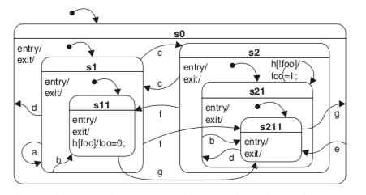

# HSM

HSM is a [Go](http://www.golang.org) library for creating [Hierarchical State Machines](https://en.wikipedia.org/wiki/UML_state_machine).

The go-test in the example directory will run through several of the state transitions depicted in the state chart, shown below. 

To run these tests change into the example directory and run the following command:

```bash
go test -v annotatedExample_test.go
```

## Installing

```bash
go get github.com/ckbaldy/hsm
```
