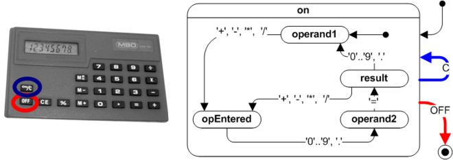

# [HSM](https://github.com/watercraft/hsm)
HSM is a [Go](http://www.golang.org) library for creating [Hierarchical State Machines](https://en.wikipedia.org/wiki/UML_state_machine). Included in this package is an interactive calculator that follows this diagram:


## Building
```
go install ...
```
## Usage
Your HSM is a struct that includes hsm.HSMBase and implements the instance interface.
```
import "github.com/watercraft/hsm"

type Calc struct {
        hsm.HSMBase
        ...
func (calc *Calc) Init(name string) {
        calc.HSMBase.Init(name, calc)
        ...
func (calc *Calc) Log() *logrus.Logger {
        ...
func (calc *Calc) LogTransition(tran *hsm.Transition, param interface{}) {
        ...
```
The *Init()* function constructs the state machine adding states, transitions, and actions see [calc.go](calc/calc.go).  *Log()* returns the logrus.Logger for HSM to use and *LogTransition()* is called for each state transition. Actions are also member functions of the HSM instance. For example, this action adds a decimal digit to the member *operand1*:
```
func (calc *Calc) ActionAppendOperand1(param interface{}) {
        calc.operand1 = calc.operand1*10 + intFromDigit(param)
}
```
Exit and entry actions can also be specified. All exit actions from the current state to the ancestor with a matching transition are called in ascending order followed by entry actions for the new state and the transition action.  Entry actions for parents of the new state are not called. Our calculator defines an entry action for the *On* state that clears the calculator for both the *OnButton* and *Clear* events:
```
	on.AddEntryActions(calc.ActionClear)
```
Our calculator differs from the picture in that the unqualified superstate *On* is a valid state for the machine with transitions to substates as well as external states.  One way to understand this is to view the superstate as the initial substate of the nested state machine and, indeed, our calculator's *On* and *Operand1* states could be merged to match the picture.
Once your machine is defined, you can then initialize your HSM and inject events.
```
        var myCalc Calc
        myCalc.Init("CALC")
        err = myCalc.Inject(CalcEventDigit, '5')
```
Here is an example run of the calculator.
```
$ calc
Welcome to the HSM Calculator!
Perform integer arithmetic with +, -, *, /, =, o=on, f=off, c=clear, q=quit
Calculator OFF
Calculator ON
     0
     2
    25
    25 +      0
    25 +      3
    28
    28 /      0
    28 /      4
     7
     0
Calculator OFF
Exit
```
